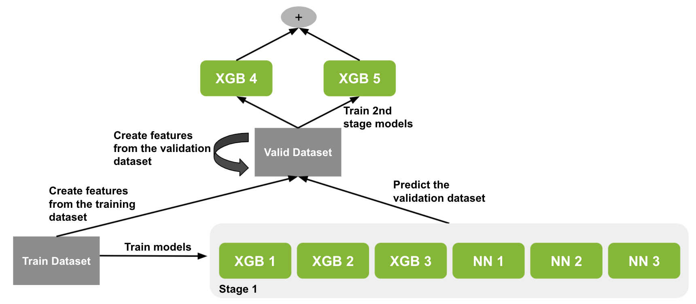
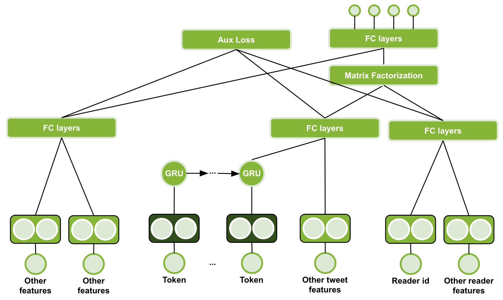
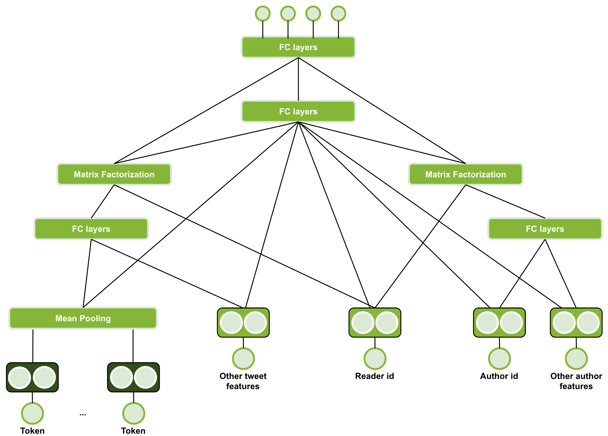
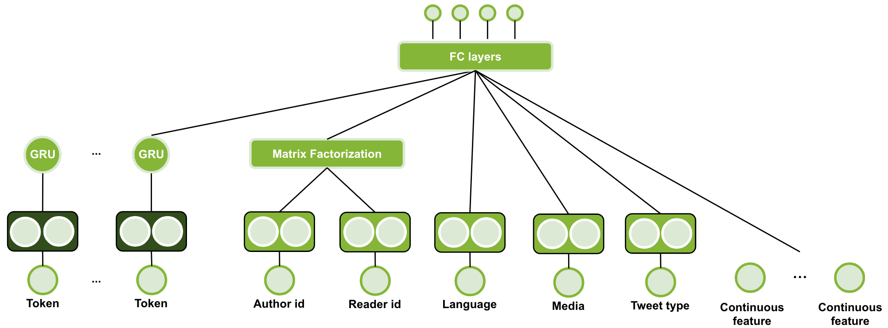

## Training

  

In this directory we provide the code to train our 6x stage 1 models and 2x stage 2 models.

### Steps

1. Train all stage 1 models using the training dataset using the code in [stage1](./stage1)

2. Predict the validation dataset using the inference code and generate `.csv` files 

3. Train all stage 2 models using the validation dataset and the prediction from stage 1

4. Add the stage 2 models to the inference code

### Neural Network Models

We developed three diverse neural network architectures.

  

  

  

You can find more details in [our paper](../GPU-Accelerated-Boosted-Trees-and-Deep-Neural-Networks-for-Better-Recommender-Systems.pdf).