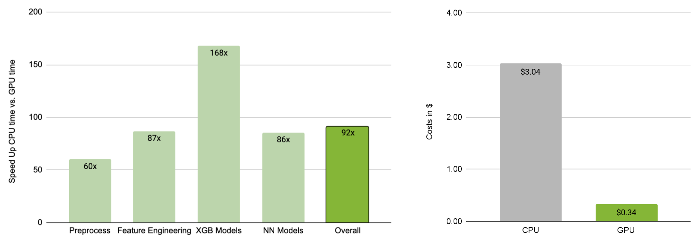

## GPU Accelerated Boosted Trees and Deep Neural Networks for Better Recommender Systems (source)

by [Chris Deotte](https://www.kaggle.com/cdeotte), [Bo Liu](https://www.kaggle.com/boliu0), [Benedikt Schifferer](https://www.linkedin.com/in/benedikt-schifferer/) and [Gilberto Titericz](https://www.linkedin.com/in/giba1/)  

This repository contains the code of the winning solution of the RecSys2021 Challenge - [*GPU Accelerated Boosted Trees and Deep Neural Networks for Better Recommender Systems*](./GPU-Accelerated-Boosted-Trees-and-Deep-Neural-Networks-for-Better-Recommender-Systems.pdf)  - achieving the highest score in all eight metrics used to calculate the final leaderboard position.  

After the competition ended, we accelerated inference with GPUs. We reduced the runtime to predict the validation dataset from **23 hours and 40 minutes** to **5 minutes and 30 seconds** using a single NVIDIA A100 GPU, a **~260 speed up**. Our repository contains the code, as well.

## RecSys2021 solution

  

Our final solution is a ensemble of stacked models. We trained 3x XGBoost and 3x neural network models using only the training dataset (stage 1). As the hosts released the validation dataset 2 weeks before the deadline, we trained two additional XGBoost models (stage 2), using features from the training dataset, features from the validation dataset and predictions of the stage 1 models as an input. In our experiment, we observed that using all 6 stage 1 models results in the highest performance.  

The code to train the stage 1 and stage 2 models are availalbe in the directory [01_training](./01_training/)

## GPU-accelerated Inference

  

This year, the hosts introduced latency constraints to provide a more realistic production environment. Around 15M tweet-user pairs had to be predicted in less than 24 hours using a single core CPU with 64GB memory (average of 6ms per example). After the competition ended, we wanted to analyze the benefits of GPUs in that environment. Using open source libraries, such as [Forrest Inference Library](https://github.com/rapidsai/cuml), [NVTabular](https://github.com/NVIDIA/NVTabular/), [RAPIDS cuDF](https://github.com/rapidsai/cudf/), [PyTorch](https://pytorch.org/) and [TensorFlow](https://www.tensorflow.org/), we accelerated our prediction pipeline end-to-end with a single NVIDIA A100 GPU with 40GB memory.  

The experiments reduced the prediction time from **23 hours and 40 minutes** on a single core CPU down to **5 minutes and 30 seconds. That is a speed-up of ~260x!!** For a fair comparison, we used the cheapest Google Cloud Platform instance with 64GB memory and enabled all CPU cores. The instance of type e2-highmem-8 with 8 CPU cores and 64GB memory requires **8 hours and 24 minutes**. Our GPU-accelerated solution is still **92x faster**. The left barchart shows a breakdown per step. Running an e2-highmem-8 instance for 8 hours and 24 minutes costs ~$3 versus running an a2-highgpu-1g for 5 minutes and 30 seconds costs $0.34 (see right barchart). **Using GPU accelerates inference pipelines by 92x and simultaneously, reduces the costs by ~8x-9x**.  
You can find more details in [our paper](./GPU-Accelerated-Boosted-Trees-and-Deep-Neural-Networks-for-Better-Recommender-Systems.pdf).
